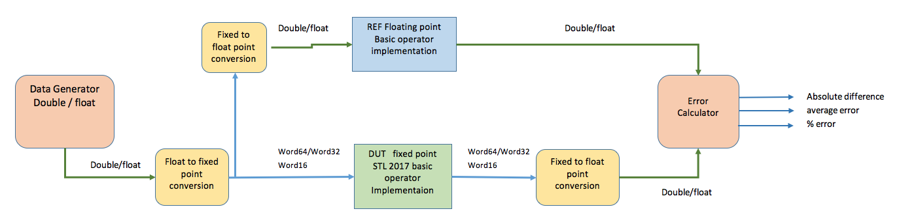

# Summary of basic operators covered by the test framework

| Main class         | Subclass           | Total baseops | Covered baseops |
|-------------------:|--------------------|:-------------:|:---------------:|
| 64 bit accumulator | 64-bit Integer Mac | 4             | 4               |
|                    | 64-bit Mac         | 7             | 7               |
|                    | 64-bit Math        | 12            | 12              |
|                    | 64-bit scale       | 7             | 7               |
|                    | 64-bit move        | 5             | 0               |
|||||
| Complex            | Complex Math       | 7             | 7               |
|                    | Complex Mac        | 9             | 9               |
|                    | Complex Move       | 10            | 0               |
|                    | Complex Scale      | 9             | 9               |
|||||
| Enhanced 32 bit    | 32*16 bit Enh MAC  | 6             | 6               |
|                    | 32*32 bit Enh MAC  | 6             | 6               |
|||||
| Control code ops   |                    | 18            | 0               |
|||||
| **Total**          |                    | 100           | 67              |

# Test setup

# Operator details

| Basic Operator    | Sub class          | Included |
|-------------------|--------------------|:--------:|
| CL_shr            | Complex scale      | Yes      |
| CL_shl            | Complex scale      | Yes      |
| CL_add            | Complex Math       | Yes      |
| CL_sub            | Complex Math       | Yes      |
| CL_scale          | Complex scale      | Yes      |
| CL_dscale         | Complex scale      | Yes      |
| CL_msu_j          | Complex Mac        | Yes      |
| CL_mac_j          | Complex Mac        | Yes      |
| CL_move           | Complex Move       | No       |
| CL_Extract_real   | Complex Move       | No       |
| CL_Extract_imag   | Complex Move       | No       |
| CL_form           | Complex Move       | No       |
| CL_multr_32x16    | Complex Mac        | Yes      |
| CL_negate         | Complex Math       | Yes      |
| CL_conjugate      | Complex Move       | No       |
| CL_mul_j          | Complex Mac        | Yes      |
| CL_swap_real_imag | Complex Move       | No       |
| C_add             | Complex Math       | Yes      |
| C_sub             | Complex Math       | Yes      |
| C_mul_j           | Complex Mac        | Yes      |
| C_multr           | Complex Mac        | Yes      |
| C_form            | Complex Move       | No       |
| CL_scale_32       | Complex scale      | Yes      |
| CL_dscale_32      | Complex scale      | Yes      |
| CL_multr_32x32    | Complex Mac        | Yes      |
| C_mac_r           | Complex Mac        | Yes      |
| C_msu_r           | Complex Mac        | Yes      |
| CL_round32_16     | Complex Math       | Yes      |
| C_Extract_real    | Complex Move       | No       |
| C_Extract_imag    | Complex Move       | No       |
| C_scale           | Complex scale      | Yes      |
| C_negate          | Complex Math       | Yes      |
| C_conjugate       | Complex Move       | No       |
| C_shr             | Complex scale      | Yes      |
| C_shl             | Complex scale      | Yes      |
| move64            | 64-bit move        | No       |
| W_add_nosat       | 64-bit Math        | Yes      |
| W_sub_nosat       | 64-bit Math        | Yes      |
| W_shl             | 64-bit scale       | Yes      |
| W_shr             | 64-bit scale       | Yes      |
| W_shl_nosat       | 64-bit scale       | Yes      |
| W_shr_nosat       | 64-bit scale       | Yes      |
| W_mac_32_16       | 64-bit Mac         | Yes      |
| W_msu_32_16       | 64-bit Mac         | Yes      |
| W_mult_32_16      | 64-bit Mac         | Yes      |
| W_mult0_16_16     | 64-bit Integer Mac | Yes      |
| W_mac0_16_16      | 64-bit Integer Mac | Yes      |
| W_msu0_16_16      | 64-bit Integer Mac | Yes      |
| W_mult_16_16      | 64-bit Mac         | Yes      |
| W_mac_16_16       | 64-bit Mac         | Yes      |
| W_msu_16_16       | 64-bit Mac         | Yes      |
| W_shl_sat_l       | 64-bit scale       | Yes      |
| W_sat_l           | 64-bit Math        | Yes      |
| W_sat_m           | 64-bit Math        | Yes      |
| W_deposit32_l     | 64-bit move        | No       |
| W_deposit32_h     | 64-bit move        | No       |
| W_extract_l       | 64-bit move        | No       |
| W_extract_h       | 64-bit move        | No       |
| W_round48_L       | 64-bit Math        | Yes      |
| W_round32_s       | 64-bit Math        | Yes      |
| W_norm            | 64-bit Math        | Yes      |
| W_add             | 64-bit Math        | Yes      |
| W_sub             | 64-bit Math        | Yes      |
| W_neg             | 64-bit Math        | Yes      |
| W_abs             | 64-bit Math        | Yes      |
| W_mult_32_32      | 64-bit Mac         | Yes      |
| W_mult0_32_32     | 64-bit Integer Mac | Yes      |
| W_lshl            | 64-bit scale       | Yes      |
| W_lshr            | 64-bit scale       | Yes      |
| W_round64_L       | 64-bit Math        | Yes      |
| Mpy_32_16_1       | 32*16 bit Enh MAC  | Yes      |
| Mpy_32_16_r       | 32*16 bit Enh MAC  | Yes      |
| Mpy_32_32         | 32*32 bit Enh MAC  | Yes      |
| Mpy_32_32_r       | 32*32 bit Enh MAC  | Yes      |
| Madd_32_16        | 32*16 bit Enh MAC  | Yes      |
| Madd_32_16_r      | 32*16 bit Enh MAC  | Yes      |
| Msub_32_16        | 32*16 bit Enh MAC  | Yes      |
| Msub_32_16_r      | 32*16 bit Enh MAC  | Yes      |
| Madd_32_32        | 32*32 bit Enh MAC  | Yes      |
| Madd_32_32_r      | 32*32 bit Enh MAC  | Yes      |
| Msub_32_32        | 32*32 bit Enh MAC  | Yes      |
| Msub_32_32_r      | 32*32 bit Enh MAC  | Yes      |
| LT_16             |                    | No       |
| GT_16             |                    | No       |
| LE_16             |                    | No       |
| GE_16             |                    | No       |
| EQ_16             |                    | No       |
| NE_16             |                    | No       |
| LT_32             |                    | No       |
| GT_32             |                    | No       |
| LE_32             |                    | No       |
| GE_32             |                    | No       |
| EQ_32             |                    | No       |
| NE_32             |                    | No       |
| LT_64             |                    | No       |
| GT_64             |                    | No       |
| LE_64             |                    | No       |
| GE_64             |                    | No       |
| EQ_64             |                    | No       |
| NE_64             |                    | No       |
